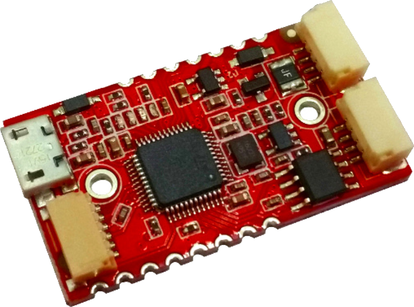
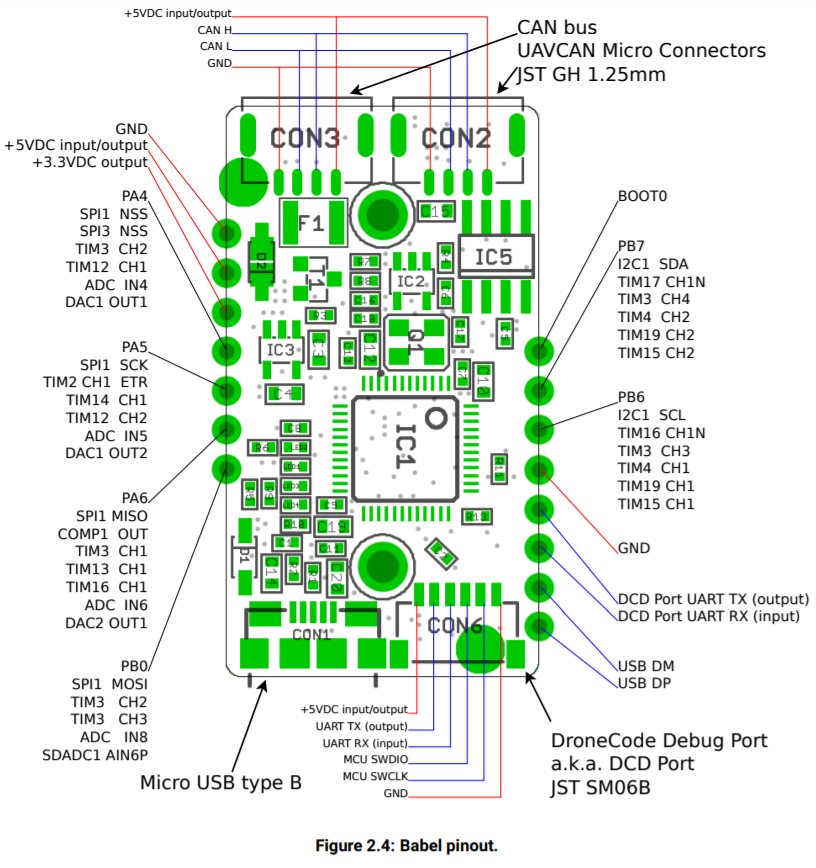
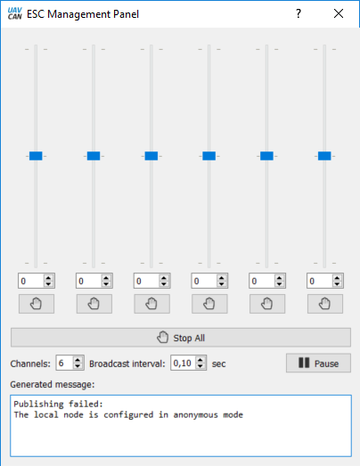
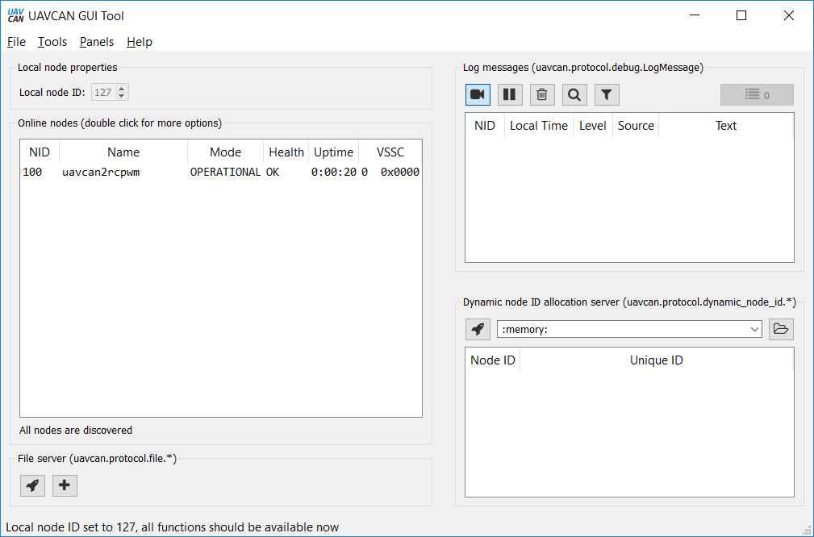
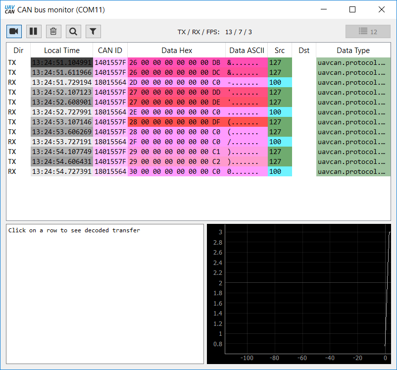
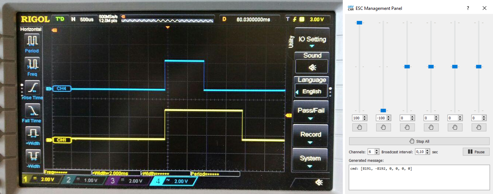

#Introduction#
In this article we will make a UAVCAN to RCPWM converter using [Zubax Babel](https://zubax.com/products/babel) hardware.  

From software point of view we will try to keep things as simple as possible. We will use only [libcanard library](https://github.com/UAVCAN/libcanard) which a very light-weight UAVCAN implementation and [stm32 standard peripheral library for stm32f37x](Caption) family of controllers. Using of different HALs and any type of RTOS is avoided on purpose, as this is very basic example. 

#Goal#
So our goal is to make Babel act as UAVCAN node and receive RCPWM values via CAN and then convert them to RCPWM signal. 

**Couple words about RCPWM.** [RCPWM](https://en.wikipedia.org/wiki/Servo_control) is the most widespread way of interaction in hobby RC world. All servos and almost all motor controllers support it(and there are lots and lots of other devices that communicate this way). Without doubt it is very old, slow and limited interface and today it must be replaced with something better like UAVCAN. But this is legacy and we have to deal with it. From physical standpoint RCPWM is just PWM signal with period of 20mS and the infromation is coded in pulse widthm which may vary from 1 mS to 2 mS with neutral value 1.5 mS. To generate that we will use timers that are available on Zubax Babel according to [datasheet](https://files.zubax.com/products/com.zubax.babel/Zubax_Babel_Datasheet.pdf) where we can find detailed pinout: 

We will use TIM12\_CH1, TIM12\_CH2, TIM3\_CH1, TIM3\_CH2, TIM3\_CH3, TIM3\_CH4, utilizing all available pins. 

**Couple words about UAVCAN.** UAVCAN is obviously a CAN bus where at least two nodes should present. In our case one node will be Zubax Babel and the second node - [UAVCAN GUI Tool](https://github.com/UAVCAN/gui_tool). We will need the second Zubax Babel or any other slcan compatible converter to connect UAVCAN GUI Tool to our CAN bus. 

**Important note**. CAN bus in general needs termination resistors connected on both sides of the line. If the line is short(10-20 cm) termination resistors may not be needed or only one may be sufficient. Сonveniently Zubax Babel has software-programmable termination resistor. If CAN bus for seems not working for some reason - please check if termination resistor is activated. 

#Implementation#
First of all hardware initialization must be performed as libcanard stm32 driver configures CAN peripheral only and avoids clocking and gpio configuration. `hw_init()` function is trivial and is left out of this text. However it may be found in the demo project [here](uavcan2rcpwm.rar). 

Some global definitions must be presented in the project in any way. Here are they

	USE_STDPERIPH_DRIVER
	STM32F37X
	HSE_VALUE=16000000
	HSE_STARTUP_TIMEOUT=0x1000

Lets begin with initialization of libcanard

    CanardInstance canard;   					//The library instance
    static uint8_t canard_memory_pool[1024]; 	//Arena for memory allocation, used by the library
    
    static void sw_init(void)
    {
    int result = 0;
    CanardSTM32CANTimings timings;
    result = canardSTM32ComputeCANTimings(RCC_Clocks.PCLK1_Frequency, 1000000, &timings);
    if(result)
    {
    __ASM volatile("BKPT #01"); 			//Lets stop on a brakpoint if something is wrong
    }
    result = canardSTM32Init(&timings, CanardSTM32IfaceModeNormal);
    if(result)
    {
    __ASM volatile("BKPT #01"); 			//Lets stop on a brakpoint if something is wrong
    }
    
    canardInit(&canard,   					// Uninitialized library instance
               canard_memory_pool, 		    // Raw memory chunk used for dynamic allocation
               sizeof(canard_memory_pool),	// Size of the above, in bytes
               onTransferReceived,			// Callback, see CanardOnTransferReception
               shouldAcceptTransfer,  		// Callback, see CanardShouldAcceptTransfer
               NULL); 
    canardSetLocalNodeID(&canard, 100);     // We will manually set note ID to 100 for now
    }
    
`canardSTM32Init` and `canardSTM32ComputeCANTimings` stm32-specific driver functions intended to simplify CAN peripheral setup. **Important note**: libcanard stm32 can driver does not use interrupts or DMA. Its up to user to decide if CAN interrupts are needed and to implement it. 

Libcanard is a static library and does not uses heap, so it needs some memory for operation which user must give it manually. That is `uint8_t canard_memory_pool[1024]`. 
Libcanard also needs two functions that must be implemented by user:

* `shouldAcceptTransfer` - this callback is called every time a transfer received to determine if it should be passed further to library or ignored. Here we should filter out all messages that are needed for our particular task
* `onTransferReceived` - this callback is called every time a transfer is received and accepted in `shouldAcceptTransfer`. Its a good idea to put incoming data handlers here

Here are these functions:
   
    bool shouldAcceptTransfer  (const CanardInstance* ins,
      							uint64_t* out_data_type_signature,
      							uint16_t data_type_id,
      							CanardTransferType transfer_type,
      							uint8_t source_node_id)
    {
        if ((transfer_type == CanardTransferTypeRequest) && (data_type_id == UAVCAN_GET_NODE_INFO_DATA_TYPE_ID))
        {
            *out_data_type_signature = UAVCAN_GET_NODE_INFO_DATA_TYPE_SIGNATURE;
            return true;
        }

        if(data_type_id == UAVCAN_EQUIPMENT_ESC_RAWCOMMAND_ID)
        {
            *out_data_type_signature = UAVCAN_EQUIPMENT_ESC_RAWCOMMAND_SIGNATURE;
            return true;
        }
        return false;
    }

	//////////////////////////////////////////////////////////////////////////////

    void onTransferReceived(CanardInstance* ins, CanardRxTransfer* transfer)
    {
        if ((transfer->transfer_type == CanardTransferTypeRequest) && (transfer->data_type_id == UAVCAN_GET_NODE_INFO_DATA_TYPE_ID))
        {
            uint8_t buffer[UAVCAN_GET_NODE_INFO_RESPONSE_MAX_SIZE];
            memset(buffer,0,UAVCAN_GET_NODE_INFO_RESPONSE_MAX_SIZE);
            uint16_t len = 0;
            len = makeNodeInfoMessage(buffer);
            int result = canardRequestOrRespond(ins,
                                                transfer->source_node_id,
                                                UAVCAN_GET_NODE_INFO_DATA_TYPE_SIGNATURE,
                                                UAVCAN_GET_NODE_INFO_DATA_TYPE_ID,
                                                &transfer->transfer_id,
                                                transfer->priority,
                                                CanardResponse,
                                                &buffer[0],
                                               (uint16_t)len);
            if(result) { __ASM volatile("BKPT #01"); }
        } 
        if(transfer->data_type_id == UAVCAN_EQUIPMENT_ESC_RAWCOMMAND_ID)
        { 
            canard_rawcmd_handler(transfer);  
        }
    }

As it is obvious from `shouldAcceptTransfer` out node will accept only two types of messages:

* [`UAVCAN_GET_NODE_INFO_DATA_TYPE_ID`](http://uavcan.org/Specification/7._List_of_standard_data_types/#getnodeinfo) - this is a request that UAVCAN GUI Tool sends to all nodes that it discovers to get some data like name, software version, hardware version and so on from it. In fact this is not necessary for our task, but supporting this type of messages is a good idea.
* [`UAVCAN_EQUIPMENT_ESC_RAWCOMMAND_ID`](http://uavcan.org/Specification/7._List_of_standard_data_types/#rawcommand) - this message contains all values needed  to generate RCPWM signal. UAVCAN GUI Tool starts to broadcast these messages when ESC Management panel is opened.

Basically all the main functions of the application happen in `canard_rawcmd_handler`. Here the values for RCPWM are extracted and passed to MCU timers: 

    #define TIMER_PERIOD               60000
    #define TIMER_PRESCALER            24

    #define RCPWM_PERIOD_uS            20000
    #define RCPWM_NEUTRAL_uS           1500
    #define RCPWM_MAGNITUDE_uS         500
    
    void canard_rawcmd_handler(CanardRxTransfer* transfer)
    {
        int16_t ar[6] = {0,0,0,0,0,0};
        int offset = 0;
    
        for(int i = 0; i<6; i++)
        {
            if(canardDecodeScalar(transfer, offset, 14, true, &ar[i])<14) {break;}
            offset += 14;
        }
        rcpwm_update(ar);
    }
    
    static inline uint32_t uS_to_ticks(uint32_t uS)
    {
        return (uS * TIMER_PERIOD) / RCPWM_PERIOD_uS;
    }

    const rcpwm_t rcpwm_outputs[] = 
    {
    {TIM12, 1, "TIM12_CH1_PA4"},
    {TIM12, 2, "TIM12_CH1_PA5"},
    {TIM3,  1, "TIM3_CH1_PA6"},
    {TIM3,  2, "TIM3_CH2_PB0"},
    {TIM3,  3, "TIM3_CH3_PB6"},
    {TIM3,  4, "TIM3_CH4_PB7"}
    };
    
    void rcpwm_update(int16_t ar[6])
    {
        for(char i = 0; i < 6; i++ )
        {
            uint32_t val = RCPWM_NEUTRAL_uS;
            ar[i] = ar[i] * RCPWM_MAGNITUDE_uS / UAVCAN_EQUIPMENT_ESC_RAWCOMMAND_MAX_VALUE;
            val += ar[i];
            TIM_SetCompare(rcpwm_outputs[i].timer,rcpwm_outputs[i].channel, uS_to_ticks(val));
        }
    }

    static void TIM_SetCompare(TIM_TypeDef* TIMx, uint8_t ch, uint32_t Compare)
    {
        if(ch == 1)  
        {
            TIMx->CCR1 = Compare;
            return;
        }
        if(ch == 2)  
        {
            TIMx->CCR2 = Compare;
            return;
        }
        if(ch == 3)  
        {
            TIMx->CCR3 = Compare;
            return;
        }
        if(ch == 4)  
        {
            TIMx->CCR4 = Compare;
            return;
        }
    }
    
Besides receiving UAVCAN messages each node must also broadcast at least one type of messages periodically - [NodeStatus](http://uavcan.org/Specification/7._List_of_standard_data_types/#nodestatus) (once 100-1000 mS should be fine). So let's make a function for that.

    #define CANARD_SERVICE_PERIOD   1000
    
    static uint32_t service_time = 0;
    
    void canard_service(void)
    {  
        if(get_uptime() < service_time + CANARD_SERVICE_PERIOD) return; // to enter this function only once a period
        service_time = get_uptime();
        gpio_toggle(GPIOE, GPIO_Pin_8); //some indication 
    
        uint8_t buffer[UAVCAN_NODE_STATUS_MESSAGE_SIZE];
        uint8_t transfer_id = 0;
    
        makeNodeStatusMessage(buffer);
    
        canardBroadcast(&canard, 
                        UAVCAN_NODE_STATUS_DATA_TYPE_SIGNATURE,
    	    			UAVCAN_NODE_STATUS_DATA_TYPE_ID,
            			&transfer_id,
            			CANARD_TRANSFER_PRIORITY_LOW,
    	    			buffer, 
    	    			UAVCAN_NODE_STATUS_MESSAGE_SIZE);
    
        const CanardCANFrame* txf = canardPeekTxQueue(&canard);
        canardSTM32Transmit(txf);
        canardPopTxQueue(&canard);
    }

To make node status message we will have to compose it manually. For that we will need three values:

* Uptime in seconds.
* Node health. Our node will always be 100% healthy.
* Node mode. Our node will always be in operational mode.

These values have to be encoded according to `NodeStatus` message description:

    uint8_t node_health = UAVCAN_NODE_HEALTH_OK;
    uint8_t node_mode   = UAVCAN_NODE_MODE_OPERATIONAL;
    
    void makeNodeStatusMessage(uint8_t buffer[UAVCAN_NODE_STATUS_MESSAGE_SIZE])
    {
        memset(buffer, 0, UAVCAN_NODE_STATUS_MESSAGE_SIZE);
        uint32_t uptime_sec = (get_uptime() / 1000);
        canardEncodeScalar(buffer,  0, 32, &uptime_sec);
        canardEncodeScalar(buffer, 32,  2, &node_health);
        canardEncodeScalar(buffer, 34,  3, &node_mode);
    }

After UAVCAN GUI Tool receives this message first time it will try to get more info about the new node, so we also have to implement function that forms `GetNodeInfo` message
    
    #define APP_VERSION_MAJOR   					99
    #define APP_VERSION_MINOR   					99
    #define APP_NODE_NAME   						"uavcan2rcpwm"
    #define GIT_HASH								0xDEADBEEF
    #define UAVCAN_GET_NODE_INFO_RESPONSE_MAX_SIZE  ((3015 + 7) / 8)
    
    uint16_t makeNodeInfoMessage(uint8_t buffer[UAVCAN_GET_NODE_INFO_RESPONSE_MAX_SIZE])
    {
        memset(buffer, 0, UAVCAN_GET_NODE_INFO_RESPONSE_MAX_SIZE);
        makeNodeStatusMessage(buffer);
    
        buffer[7] = APP_VERSION_MAJOR;
        buffer[8] = APP_VERSION_MINOR;
        buffer[9] = 1;  // Optional field flags, VCS commit is set
        uint32_t u32 = GIT_HASH;
        canardEncodeScalar(buffer, 80, 32, &u32); 
    
        readUniqueID(&buffer[24]);
        const size_t name_len = strlen(APP_NODE_NAME);
        memcpy(&buffer[41], APP_NODE_NAME, name_len);
        return 41 + name_len ;
    }

#App architecture#
As libcanard does not use any interrupts and because our intention to keep everything simple the application will be organised as ordinar cycle

    int main(void)
    { 
        /*!< At this stage the microcontrollers clock setting is already configured, 
           this is done through SystemInit() function which is called from startup
           file (startup_stm32f37x.s) before to branch to application main.
           To reconfigure the default setting of SystemInit() function, refer to
           system_stm32f37x.c file
         */
        RCC_GetClocksFreq(&RCC_Clocks); //To make sure RCC is initialised properly
        hw_init(); 
        sw_init();
        SysTick_Config(SystemCoreClock / 1000); //To make systick event happen every 1 mS
    
        while(1)
        {
            canard_sender();
            canard_receiver();
            canard_service();
        }
    }
        
The only interrupt used in the application is SysTick interrupt for uptime counter with 1 mS resolution. 

    void systick_isr(void);
    void SysTick_Handler(void)
    {
        systick_isr();
    }
    
    static uint32_t  uptime = 0;
	void systick_isr(void)
    {
        uptime++;
    }

    uint32_t get_uptime(void)
    {
        return uptime;
    }

As libcanard does not use any interrupts it is up to user when and how to receive and transmit UAVCAN messages. In this application we will constantly poll if any message was received by MCU CAN peripheral and process it. We will also poll if library has any new messages to transmit and manually extract them from the library and pass to CAN transmitter. 

    void canard_sender(void)
    {
        const CanardCANFrame* txf = canardPeekTxQueue(&canard); 
    
        while(txf)
        {
            const int tx_res = canardSTM32Transmit(txf);
            if (tx_res < 0) // Failure - drop the frame and report
            {
                __ASM volatile("BKPT #01"); 
            }
            if(tx_res > 0)
            {
                canardPopTxQueue(&canard);
            }
            txf = canardPeekTxQueue(&canard); 
        }
    }
    

    void canard_receiver(void)
    {
        CanardCANFrame rx_frame;
        int res = canardSTM32Receive(&rx_frame);
        if(res)
            {
                canardHandleRxFrame(&canard, &rx_frame, get_uptime() * 1000);
            }
    }

Now its time to try the app. The demo IAR project may be found [here](uavcan2rcpwm.rar). 
After you flash your Zubax Babel with it you must see green LED blinking once a second. If you then connect it to UAVCAN GUI Tool you should see something like this: 

It may be also useful to go to bus monitor and check if messages are coming properly

Messages from node with ID 100 are present on the picture above. And they keep appearing once a second. 

Now its time to go to esc panel and try to move sliders. If you connect oscilloscope Babel you may see something like this:

Or you may connect servos and see them moving after the slider in ESC panel. 