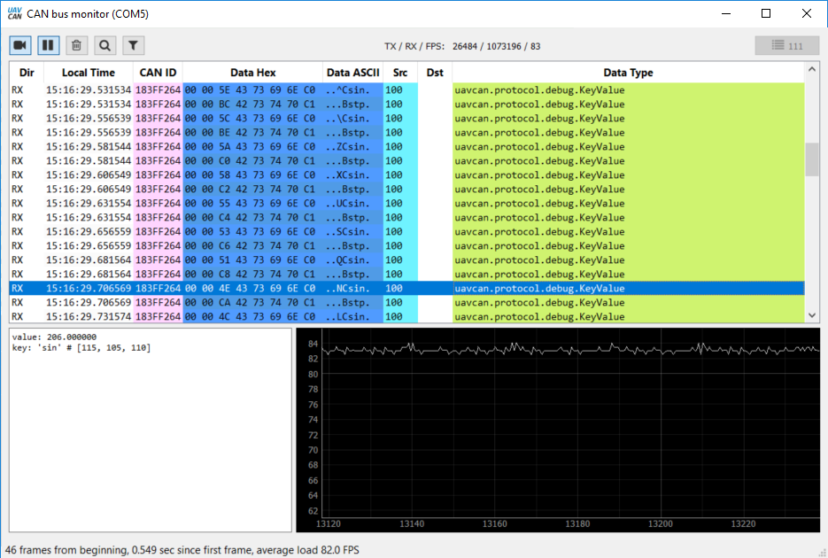
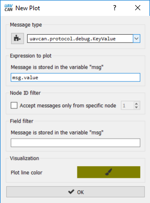
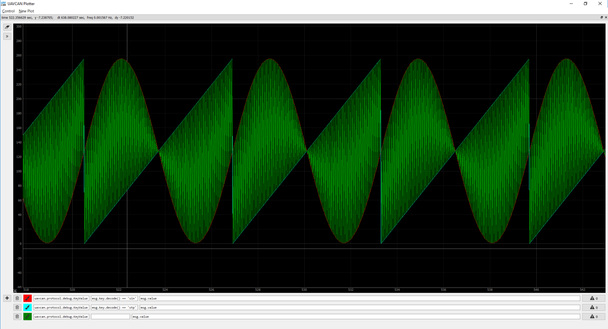
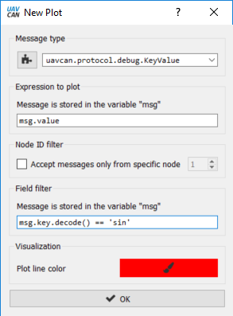
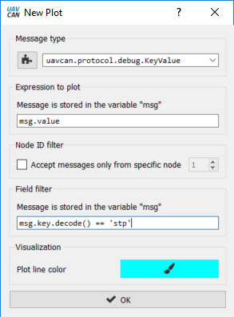
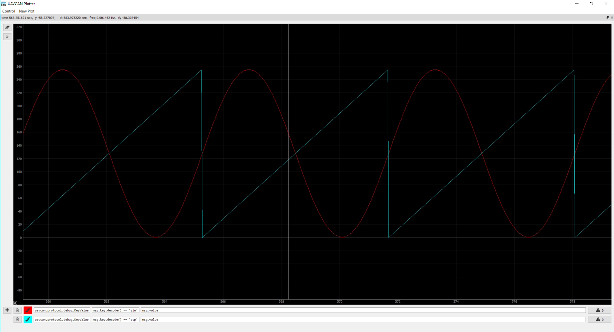

#Introduction#
In this article we will turn[Zubax Babel](https://zubax.com/products/babel) into simple UAVCAN publisher. 
All the code here is based on previous tutorial. 

#Goal#
Out goal is to publish couple different values to UAVCAN and to check if everything works properly plotting graphs in UAVCAN GUI Tool plotter. 

#Implementation#
We will use UAVCAN message [`uavcan.protocol.debug.KeyValue`](http://uavcan.org/Specification/7._List_of_standard_data_types/#keyvalue). UAVCAN specification says `float32` values can be broadcasted this way. We can use it to broadcast some custom sensor data, ADC data or just any named value. For the sake of simplicity in this tutorial we will broadcast sin values. But assuming MCU resorces are quiet constrained we will take values from lookup table. We will also broadcast the second value - current table index. 

    #define PUBLISHER_PERIOD_mS 25
    #define UAVCAN_PROTOCOL_DEBUG_KEYVALUE_ID   16370   
    #define UAVCAN_PROTOCOL_DEBUG_KEYVALUE_SIGNATURE0xe02f25d6e0c98ae0 
    #define UAVCAN_PROTOCOL_DEBUG_KEYVALUE_MESSAGE_SIZE 62   

    static uint32_t publisher_time = 0;
    static int step = 0;

    void canard_publisher(void)
    {  
        if(get_uptime() < publisher_time + PUBLISHER_PERIOD_mS) {return;} 
        publisher_time = get_uptime();
      
        uint8_t buffer[UAVCAN_PROTOCOL_DEBUG_KEYVALUE_MESSAGE_SIZE];
        memset(buffer,0x00,UAVCAN_PROTOCOL_DEBUG_KEYVALUE_MESSAGE_SIZE);
        
        step++;
        if(step == 256) 
        {
            step = 0;
        }
        
        float val = (float)sine_wave[step];
        uint8_t transfer_id = 0;
        int res = 0;
      
        canardEncodeScalar(buffer, 0, 32, &val);
        memcpy(&buffer[4], "sin", 3);
        res = canardBroadcast(&canard, 
                              UAVCAN_PROTOCOL_DEBUG_KEYVALUE_SIGNATURE,
                              UAVCAN_PROTOCOL_DEBUG_KEYVALUE_ID,
                              &transfer_id,
                              CANARD_TRANSFER_PRIORITY_LOW,
                              &buffer[0], 
                              7);
        if(res)
        {
            __ASM volatile("BKPT #01"); 
        }
      
        memset(buffer,0x00,UAVCAN_PROTOCOL_DEBUG_KEYVALUE_MESSAGE_SIZE);
        val = (float)step;
        canardEncodeScalar(buffer, 0, 32, &val);
        memcpy(&buffer[4], "stp", 3);
      
        res = canardBroadcast(&canard, 
                              UAVCAN_PROTOCOL_DEBUG_KEYVALUE_SIGNATURE,
                              UAVCAN_PROTOCOL_DEBUG_KEYVALUE_ID,
                              &transfer_id,
                              CANARD_TRANSFER_PRIORITY_LOW,
                              &buffer[0], 
                              7);
            if(res)
        {
            __ASM volatile("BKPT #01"); 
        }
   
    }

**Important note.** Integer and float values have very different bit-structure. As libcanard expects float data type for `uavcan.protocol.debug.KeyValue` it is important to give exactly what it wants - a float value. So despite we have unsigned integer (in fact even `uint8_t`) sinus table, it is important to provide `canardEncodeScalar` function with `float` type parameter. 

Now let's add our publisher to main, so now it looks like this: 

    int main(void)
    {
    /*!< At this stage the microcontrollers clock setting is already configured, 
     this is done through SystemInit() function which is called from startup
     file (startup_stm32f37x.s) before to branch to application main.
     To reconfigure the default setting of SystemInit() function, refer to
     system_stm32f37x.c file
     */
        RCC_GetClocksFreq(&RCC_Clocks); //To make sure RCC is initialised properly
        hw_init();
        sw_init();  
        SysTick_Config(SystemCoreClock / 1000);
        while(1)
        {
            canard_sender();
            canard_receiver();
            canard_service();
            canard_publisher();
        }
    }

Now its time to flash the firmware to Babel and check if everything is working as expected. You should find a bunch of new messages in Bus monitor panel:

Now lets go to `UAVCAN Plotter` which may be found in `Tools -> Plotter` menu.

Firstly lets just plot every message of `uavcan.protocol.debug.KeyValue` type. For that open the Plotter and hit that '+' button in bottom left corner of the window. Fill in the plot details as shown below and hit `ok`:

 

Now you should see something like this: 

The plot looks pretty weird because plotter tries to display all values of `debug.KeyValue` type and Babel transmitss two diifferent values at: sinus value and step. Lets delete this plot and add two more, one for each separate value:

     

Now graphs look properly:

