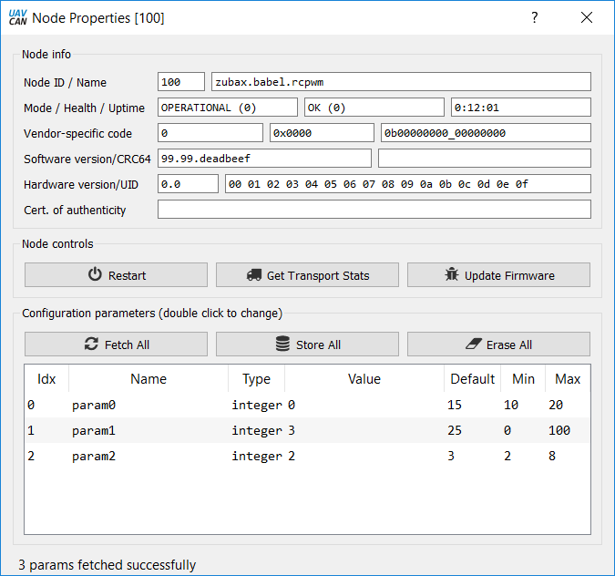
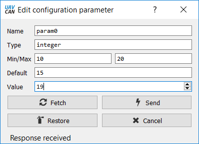

# Introduction #
In this article we will make an example of UAVCAN service. 

# Goal #
The most obvious example of service in UAVCAN is node configuration. We will use [`uavcan.protocol.param.GetSet`](http://uavcan.org/Specification/7._List_of_standard_data_types/#getset) data type to read and write some parameters in Babel.

# Implementation #
So let's give our [Zubax Babel](https://zubax.com/products/babel) some parameters that we will try to configure from UAVCAN GUI Tool. For the sake of simplicity in this example we will have only integer numeric parameters though UAVCAN allows you to have parameters of just any type you want.

    typedef struct
    {
    uint8_t * name;
    int64_t val; 
    int64_t min;
    int64_t max;
    int64_t defval;
    } param_t;

In this example we will have three integer parameters. It is not necessary but mey be considered good practice to specify default value and acceptable value range for numeric parameters.

    static param_t parameters[] = 
    {
      {"param0", 0, 10,20, 15},
      {"param1", 1, 0, 100, 25},
      {"param2", 2, 2, 8,  3 },
    };
    
We will also need a couple ways to access tgese parameters: by index and by name with some safety checks. 

    static inline param_t * GetParamByIndex(uint16_t index)
    {
        if(index >= ARRAY_SIZE(parameters)) 
        {
            return NULL;
        }
        return &parameters[index];
    }
    

    static inline param_t * GetParamByName(uint8_t * name)
    {
        for(uint16_t i = 0; i < ARRAY_SIZE(parameters); i++)
        {
            if(strncmp(name, parameters[i].name,strlen(parameters[i].name)) == 0) 
            {
                  return &parameters[i];
            }
        }  
        return NULL;
    }
    
Now we need to add new type of UAVCAN messages that we want to process to `shouldAcceptTransfer` and add its handler call to `onTransferReceived`. We should also write handler. Here it is: 

    void canard_getset_handle(CanardRxTransfer* transfer)
    {
    uint16_t index = 0xFFFF;
    uint8_t tag    = 0;
    int offset     = 0;
    int64_t val    = 0;

    canardDecodeScalar(transfer, offset,  13, false, &index);
    offset += 13;
    canardDecodeScalar(transfer, offset, 3, false, &tag);
    offset += 3;

    if(tag == 1)
    {
        canardDecodeScalar(transfer, offset, 64, false, &val);
        offset += 64;
    } 

    uint16_t n = transfer->payload_len - offset / 8 ;
    uint8_t name[16]      = "";
    for(int i = 0; i < n; i++)
    {
        canardDecodeScalar(transfer, offset, 8, false, &name[i]);
        offset += 8;
    }

    param_t * p = NULL;

    if(strlen((char const*)name)) 
    {
        p = GetParamByName(name); //we should always try access by name first
    }
    else
    {
        p = GetParamByIndex(index);  //If no name was provided - try access by index
    }

    if((p)&&(tag == 1))
    {
        p->val = val;
    }

    uint8_t  buffer[64] = "";
    uint16_t len = canardEncodeParam(p, buffer);
    int result = canardRequestOrRespond(&canard,
                                        transfer->source_node_id,
                                        UAVCAN_PROTOCOL_PARAM_GETSET_SIGNATURE,
                                        UAVCAN_PROTOCOL_PARAM_GETSET_ID,
                                        &transfer->transfer_id,
                                        transfer->priority,
                                        CanardResponse,
                                        &buffer[0],
                                        (uint16_t)len);
  
    }

We also need to create a function that will encode integer param to `uavcan.protocol.param.GetSet` message. It will be a little nasty as bit operations always 
are, but here it is. 
    
    uint16_t canardEncodeParam(param_t * p, uint8_t * buffer)
    {
    uint8_t n     = 0;
    int offset    = 0;
    uint8_t tag   = 1;
    if(p==NULL)
    {   
        tag = 0;
        canardEncodeScalar(buffer, offset, 5, &n);
        offset += 5;
        canardEncodeScalar(buffer, offset,3, &tag);
        offset += 3;
        
        canardEncodeScalar(buffer, offset, 6, &n);
        offset += 6;
        canardEncodeScalar(buffer, offset,2, &tag);
        offset += 2;
        
        canardEncodeScalar(buffer, offset, 6, &n);
        offset += 6;
        canardEncodeScalar(buffer, offset, 2, &tag);
        offset += 2;
        buffer[offset / 8] = 0;
        return ( offset / 8 + 1 );
    }
    canardEncodeScalar(buffer, offset, 5,&n);
    offset += 5;
    canardEncodeScalar(buffer, offset, 3, &tag);
    offset += 3;
    canardEncodeScalar(buffer, offset, 64, &p->val);
    offset += 64;
    
    canardEncodeScalar(buffer, offset, 5, &n);
    offset += 5;
    canardEncodeScalar(buffer, offset, 3, &tag);
    offset += 3;
    canardEncodeScalar(buffer, offset, 64, &p->defval);
    offset += 64;
    
    canardEncodeScalar(buffer, offset, 6, &n);
    offset += 6;
    canardEncodeScalar(buffer, offset, 2, &tag);
    offset += 2;
    canardEncodeScalar(buffer, offset, 64, &p->max);
    offset += 64;
    
    canardEncodeScalar(buffer, offset, 6, &n);
    offset += 6;
    canardEncodeScalar(buffer, offset,2,&tag);
    offset += 2;
    canardEncodeScalar(buffer, offset,64,&p->min);
    offset += 64;
    
    memcpy(&buffer[offset / 8], p->name, strlen((char const*)p->name));
    /* See important note below */
    return  (offset/8 + strlen((char const*)p->name)); 
    }

**Important note** According to [`UAVCAN DSDL specification`](http://uavcan.org/Specification/3._Data_structure_description_language/), section **Dynamic arrays**, there should be a bit field(often 8 bits wide) representing the length of the array prepending array field. But there is one important detail, which plays role in this particular case. DSDL also describes `tail array optimization` which means that in case when array is the last field in the UAVCAN message there is no need to specify its length and it must be skipped. That is why in the function above we did not specify length of the parameter name

Now its time to go to UAVCAN GUI Tool and check our newly-created parameters. Double-click on the node record in the online nodes table and will see Node properties window. Click button `Fetch all` to read all parameters from Babel. You should see something like this: 

Now double click on any paramter and try changing its value. 

Now close Node properties window and re-open it and refetch all the parameters to make sure you actually updated parameter value. 